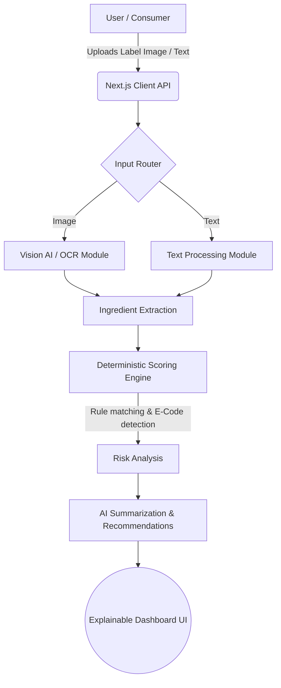

<div align="center">
  
  <h1 align="center">SafeBite India</h1>
  <p align="center">
    <strong>AI-Powered Food Label Scanner and Biosafety Awareness Platform</strong>
    <br />
    Decoding complex food labels to protect India's health, one bite at a time.
  </p>
  <p align="center">
    <a href="#features">Features</a> •
    <a href="#architecture">Architecture</a> •
    <a href="#scoring-methodology">Scoring</a> •
    <a href="#installation">Installation</a> •
    <a href="#contributing">Contributing</a>
  </p>
  
  
  
  
  
  
</div>

<hr />

## 🌟 Overview

SafeBite India is an intelligent web application developed for Biosafety Standards and Ethics awareness. It empowers consumers by demystifying complex ingredient lists, exposing harmful additives (E-codes), and identifying ultra-processed foods using a deterministic scoring engine combined with an AI interpretation layer.

This project was built to transform academic biosafety knowledge into a practical, everyday utility for Indian consumers navigating supermarket aisles.

## ✨ Features

- 📸 **Smart Label Scanning**: Upload an image of a food label or manually enter the ingredients.
- 🧠 **Explainable AI Analysis**: An intuitive dashboard that clearly explains *why* a product received its score, highlighting both positive and negative impacts.
- 🚦 **Interactive Ingredient Badges**: Ingredients are automatically color-coded based on safety (Safe, Moderate, High Risk) with expandable details on regulatory status and health risks.
- 📊 **Category Breakdown**: Granular scoring across six key axes: Nutrition, Additives, Allergens, Processing, Biosafety & GMO, and Ethics.
- 📚 **Interactive Learning Portal**: A comprehensive, modern educational hub covering Biosafety Levels (BSL), the Cartagena Protocol, HACCP principles, FSSAI regulations, and the ethical impact of food supply chains (e.g., the palm oil crisis).
- 🚀 **One-Click Demos**: Instantly test the application using predefined sample products like Instant Noodles or Multigrain Bread directly from the home page.

## 🛠️ Technology Stack

- **Framework**: Next.js 15 (App Router)
- **Library**: React 19
- **Language**: TypeScript
- **Styling**: Tailwind CSS, shadcn/ui components
- **Icons**: Lucide React
- **Deployment**: Render

- **Deployment link**: https://safebiteindia.onrender.com/
## 🏗️ Architecture



## 🗂️ Folder Structure

```
safebite-india/
├── app/                  # Next.js App Router pages
│   ├── about/            # Educational Hub
│   ├── api/              # Backend API routes for analysis
│   ├── results/          # Explainable Dashboard
│   └── scanner/          # Label input UI
├── components/           # Reusable UI components (shadcn & custom)
│   ├── home/             # Landing page components
│   ├── results/          # Dashboard specific widgets
│   └── ui/               # Base design system
├── data/                 # Static datasets (Demo Products)
├── lib/                  # Core business logic
│   ├── constants.ts      # Additive database, rules, and constants
│   ├── scoring.ts        # Deterministic scoring engine algorithms
│   └── types.ts          # TypeScript interfaces
└── public/               # Static assets
```

## ⚖️ Scoring Methodology

The scoring engine operates on a hybrid model, heavily leaning on deterministic rules based on FSSAI guidelines to ensure accuracy and predictability, supported by AI for context interpretation.

1. **Nutrition (60 base)**: Penalized for excessive trans fats, sodium (>400mg), and sugar. Rewarded for high fiber and whole grains.
2. **Additives (100 base)**: Deductions based on harmful E-codes (e.g., E319 TBHQ, Artificial colors).
3. **Allergens (85 base)**: Penalized for high-risk allergens (Peanuts, Gluten, Dairy) and cross-contamination risks.
4. **Processing (55 base)**: Heavily penalized for ultra-processed triggers; rewarded for minimal processing.
5. **Biosafety & GMO (75 base)**: Deductions for GMOs or lack of FSSAI license. Rewarded for organic/non-GMO verification.
6. **Ethics (65 base)**: Deductions for unsustainably sourced ingredients (e.g., Palm Oil). Rewarded for fair trade and recyclable packaging.

**Overall Risk Categories:**
- 🟢 **Good**: 70 – 100
- 🟡 **Moderate**: 40 – 69
- 🔴 **Poor**: 0 – 39

## 🚀 Getting Started

### Installation

1. **Clone the repository:**
   ```bash
   git clone https://github.com/TanishaBhide/SafeBiteIndia.git
   cd SafeBiteIndia
   ```

2. **Install dependencies:**
   ```bash
   npm install
   ```

3. **Environment Setup:**
   Create a `.env.local` file in the root directory and add necessary API keys (e.g., Groq / Anthropic for AI analysis):
   ```env
   GROQ_API_KEY=your_api_key_here
   ```

### Running Locally

Start the development server:
```bash
npm run dev
```
Open [http://localhost:3000](http://localhost:3000) in your browser.

### Building for Production

```bash
npm run build
npm run start
```

## 🔮 Future Enhancements

- **Barcode Scanning:** Integration with mobile cameras to scan product barcodes directly.
- **User Accounts:** Allow users to save their scan history and track their dietary choices over time.
- **Crowdsourced Database:** Allow verified users to submit and correct food label data to grow an open-source database.
- **Regional Languages:** Support for Hindi and regional languages for wider accessibility across India.

## 🤝 Contributing

Contributions make the open-source community an amazing place to learn, inspire, and create. Any contributions you make are **greatly appreciated**.

1. Fork the Project
2. Create your Feature Branch (`git checkout -b feature/AmazingFeature`)
3. Commit your Changes (`git commit -m 'Add some AmazingFeature'`)
4. Push to the Branch (`git push origin feature/AmazingFeature`)
5. Open a Pull Request

## 📄 License

Distributed under the MIT License. See `LICENSE` for more information.

## 🙏 Acknowledgements

- Built for the Biosafety Standards and Ethics Curriculum.
- UI elements inspired by modern SaaS applications and [shadcn/ui](https://ui.shadcn.com/).
- Icons provided by [Lucide](https://lucide.dev/).
